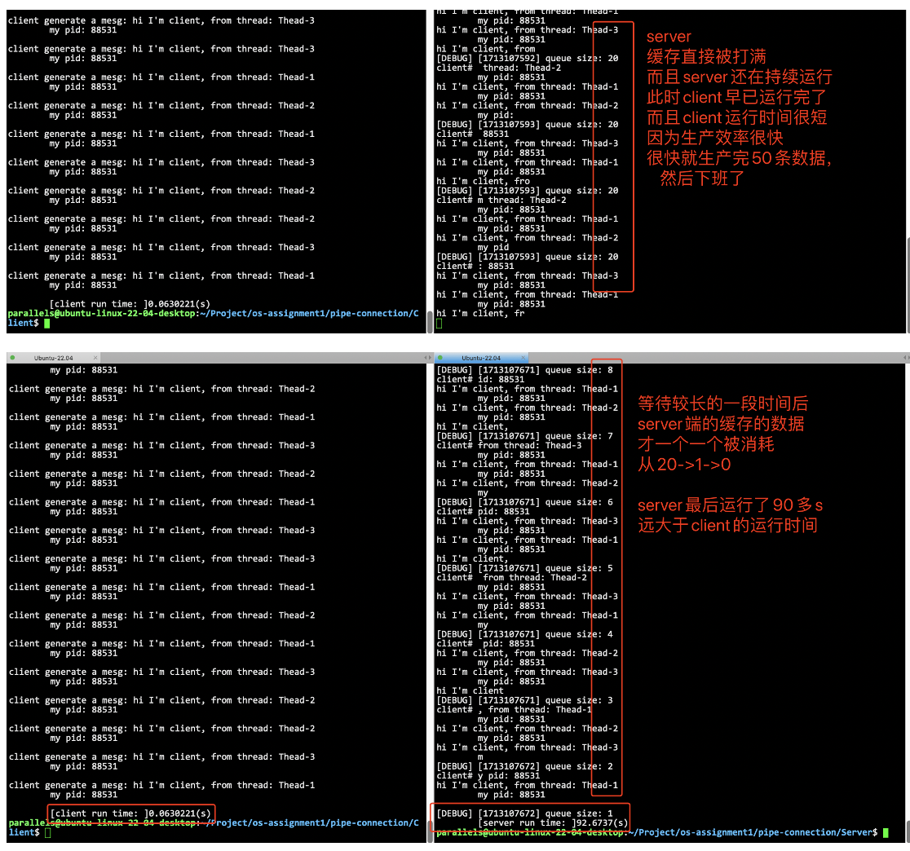

# Experiments and analysis of different lambda parameter combinations

- **[简体中文](./diff_lambda_test-CN.md)**
- **[English](./diff_lambda_test.md)**

In the negative exponential distribution, if the parameter is larger, it means that the number generated by the C++11 generator is smaller, which means that the sleep() time is shorter, which means that the events are more frequent.
Secondly, the logic I set is that the server will not exit until the client closes the write-side descriptor.
Third, the logic I set is that the client will exit on its own after sending 50 messages (this number can be changed in the configuration file. The set number needs to be greater than 20, the size of the buffer, so that you can see the buffer being opened later. full).

## If Server's lambda is greater than or equal to Client's lambda

At this time, consumption efficiency must be greater than/equal to production efficiency from a macro perspective. The phenomenon that should occur at this time is: the cache on the server side will not be filled up, and will always be in a low-level state. Because the client produces very slowly, there will be very little data coming to the server through the pipeline, and the consumption efficiency is very high. , so the number of messages in the server cache will be very small. In fact, in layman's terms: supply exceeds demand, and things will be sold out immediately, when they are released, and when they are sold out, so the running time of the server and client will not be very different.

As shown in the figure, the lambda on the server side is 10 and the client side is 1.

As shown in the figure, the lambda on the server side is 1 and the client side is 1.

It can be seen that the server cache has always been at a low level. Secondly, the client running time is almost the same as that of the server. Because the server is closed, the client must have closed the file descriptor, that is, 50 messages have been sent. So quit. At the same time, the server-side buffer is at a low level, so the server's workers do not need to take a long time to process the contents of the remaining server buffer.

**Therefore, it can be concluded that if the lambda of the server is greater than or equal to the lambda of the client, the running time of the server will be slightly longer than the processing time of one task of the client (that is, a task starts from the writing end of the pipeline and is processed by the worker thread on the server side. this period of time).**

## If Server's lambda is smaller than Client's lambda

**At this time, consumption efficiency is less than production efficiency. The phenomenon that should occur at this time is: the cache on the server side will be full! Because the client produces too fast, there will be a lot of data coming to the server through the pipeline, and the consumption efficiency is very small, so the number of messages in the server cache will be very large. Very much. Of course, after the server cache is full, the connector thread will also be blocked (because of the existence of mutually exclusive synchronization variables). At this time, even the pipeline may be full, causing the program to crash, so in this experiment, I set the pipe size to a sufficient value so that we can observe the situation when the server cache is full. In fact, in layman's terms: supply exceeds demand, things will accumulate, and it will take a long time for them to be consumed after they are released!**

As shown in the figure, the lambda on the server side is 1 and the client side is 10. The situation at this time is also in line with expectations. The buffer is full and the server cannot run out for a long time.